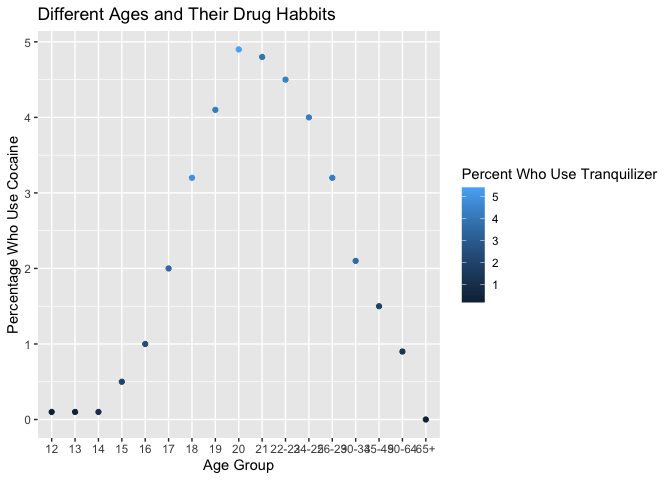

First Attempt At Git
================

# Welcome

This is a lovely little README\!

# Drugs\!

While looking through the FiveThirtyEight package I saw this super
interesting dataset, and simply had to use it\!

# Plot

This is a plot of different age groups and the percentage of them that
use Cocaine and Horse Tranquilizer (Ketamine).

``` r
library(Stat2Data)
library(tidyverse)
```

    ## ── Attaching packages ─────────────────────────────────────── tidyverse 1.3.1 ──

    ## ✓ ggplot2 3.3.5     ✓ purrr   0.3.4
    ## ✓ tibble  3.1.4     ✓ dplyr   1.0.7
    ## ✓ tidyr   1.1.3     ✓ stringr 1.4.0
    ## ✓ readr   2.0.1     ✓ forcats 0.5.1

    ## ── Conflicts ────────────────────────────────────────── tidyverse_conflicts() ──
    ## x dplyr::filter() masks stats::filter()
    ## x dplyr::lag()    masks stats::lag()

``` r
library(fivethirtyeight)
```

    ## Some larger datasets need to be installed separately, like senators and
    ## house_district_forecast. To install these, we recommend you install the
    ## fivethirtyeightdata package by running:
    ## install.packages('fivethirtyeightdata', repos =
    ## 'https://fivethirtyeightdata.github.io/drat/', type = 'source')

``` r
data("drug_use")
ggplot(drug_use, aes(x = age, y =  cocaine_use, color = tranquilizer_use)) +
  geom_point() +
  labs(title = 'Different Ages and Their Drug Habbits', x = 'Age Group', y = 'Percentage Who Use Cocaine', color = 'Percent Who Use Tranquilizer')
```

<!-- -->

# Conclusions

People use drugs, but a surprising low percentage of these groups
consume these drugs, which is good\!
